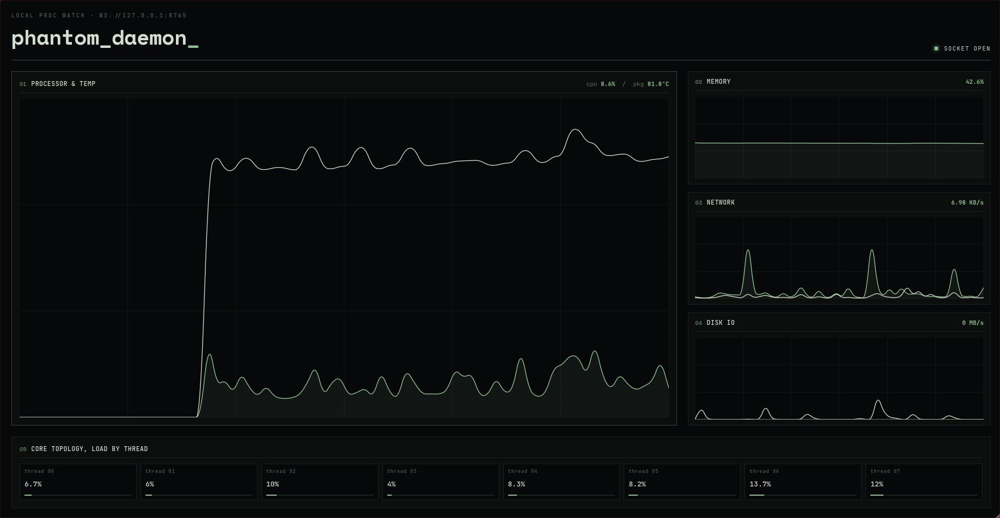

# PHANTOM DAEMON

A light-weight system resource monitor designed to run continuously on servers. Now you can see your server stats in seconds with a cool-looking web UI without wasting half the RAM of your Raspberry Pi on heavy monitors like Beszel!



## Description

Phantom Daemon is a simple Python script that streams live system stats to a web UI over WebSockets. Designed specifically for low-resource environments, it serves both the frontend static interface and the WebSocket telemetry pipeline concurrently in a single lightweight process.

## Motivation

I have a Raspberry Pi Zero 2W running 24/7 as a home server with only 512MB of RAM. Heavy dashboards like Beszel consume far too many resources, so I decided to make my own dark-themed, ultra-lightweight resource monitor and submit it for [3AM](https://3am.hackclub.com/).

## Features

- **Ultra-lightweight:** Minimal RAM and CPU footprint.
- **Real-time Telemetry:** Live streaming of CPU, RAM, Disk I/O, Network I/O, and CPU temperatures.
- **Fully Configurable:** Easily adjust host IP, ports, WebUI path, and broadcast update frequency.
- **Embedded Web Server:** Serves static frontend assets and WebSocket data in a single runner script.

---

## Prerequisites

- **Python 3.8+**
- Linux / macOS / Windows system with network access

---

## Quick Start

### 1. Clone the Repository

```bash
git clone https://github.com/yousseftechdev/phantom-daemon
cd phantom-daemon
```

### 2. Install Dependencies

Install the required Python modules:

```bash
pip install psutil websockets
```

### 3. Directory Layout

Ensure your files are structured as follows:

```text
phantom-daemon/
│
├── daemon.py
├── settings.py
└── webUI/
    └── index.html
```

---

## Configuration

Custom settings can be modified directly in `settings.py`:

```python
HOST = "0.0.0.0"  # WebSocket listen host (use "0.0.0.0" for LAN access)
PORT = 8765  # WebSocket server port
WEBUI_HOST = "0.0.0.0"  # Web UI HTTP host
WEBUI_PORT = 5500  # Web UI HTTP port
WEBUI_DIR = "webUI"  # Path to Web UI static directory
UPDATE_RATE_HZ = 2  # Telemetry update rate in Hertz
```

> **Note:** To access the Web UI from another device on your local network, set `HOST` and `WEBUI_HOST` to `"0.0.0.0"`.

---

## Running Phantom Daemon

Start the daemon:

```bash
python daemon.py
```

Once launched, access the dashboard in your web browser:

```text
http://<server-ip>:5500
```

---

## Running as a System Service (systemd)

To run Phantom Daemon automatically in the background on boot:

1. Create a service file:
   ```bash
   sudo nano /etc/systemd/system/phantom-daemon.service
   ```

2. Add the following configuration:
   ```ini
   [Unit]
   Description=Phantom Daemon Service
   After=network.target

   [Service]
   Type=simple
   User=pi
   WorkingDirectory=/home/pi/phantom-daemon
   ExecStart=/usr/bin/python3 /home/pi/phantom-daemon/daemon.py
   Restart=always
   RestartSec=5

   [Install]
   WantedBy=multi-user.target
   ```

3. Enable and start the service:
   ```bash
   sudo systemctl daemon-reload
   sudo systemctl enable phantom-daemon
   sudo systemctl start phantom-daemon
   ```